# rdma

[![Latest Version]][crates.io]
[![Documentation]][docs.rs] 
![License]

Low-level RDMA API.

[crates.io]: https://crates.io/crates/rdma
[Latest Version]: https://img.shields.io/crates/v/rdma.svg
[Documentation]: https://docs.rs/rdma/badge.svg
[docs.rs]: https://docs.rs/rdma
[License]: https://img.shields.io/crates/l/rdma.svg

# Environment

This crate requires the latest [rdma-core](https://github.com/linux-rdma/rdma-core) installation.

Please make sure the following commands work:

```bash
$ pkg-config --modversion libibverbs
1.14.41.0
$ pkg-config --modversion librdmacm
1.3.41.0
```

The output also shows the minimum required versions.

# Develop

## Examples

Add a Soft-RoCE device:

```bash
sudo rdma link add rxe0 type rxe netdev ens33
```

`rxe0` is the RDMA device name. You can name it whatever you want. `ens33` is the name of a network device. The name of the network device may be different. You can see it by running command `ifconfig`. 

There is a tutorial for Chinese users: <https://zhuanlan.zhihu.com/p/361740115>.

Please install the tool [just](https://github.com/casey/just) if you don't have it.

Install the examples:

```bash
just install-examples
```

Run the example `rdma-devices`:

```
$ rdma-devices
|          name          |          guid          |
|------------------------|------------------------|
|          rxe0          |    26418cfffe021df9    |
```

Run the example `rdma-rcpp`:

Server side:

```
rdma-rcpp
```

Client side:

```
rdma-rcpp 127.0.0.1
```

## Resources

The RDMA resources are managed by reference counting.

The graph below shows the relations between resources.


